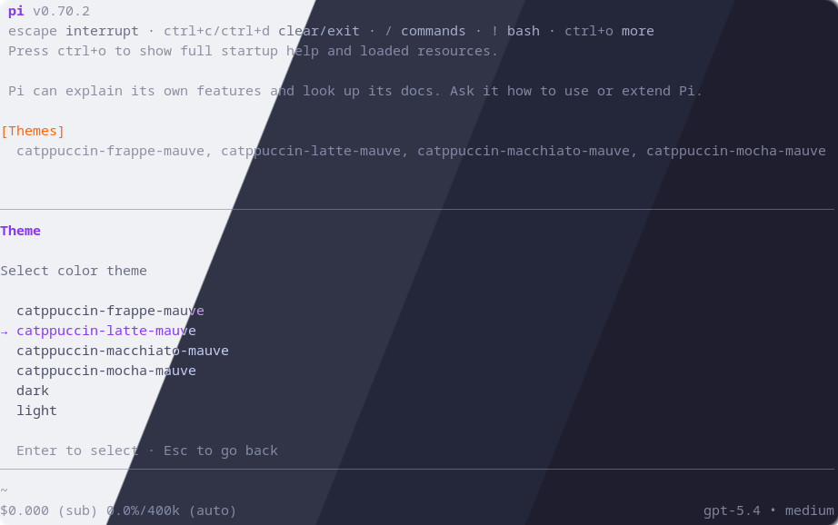
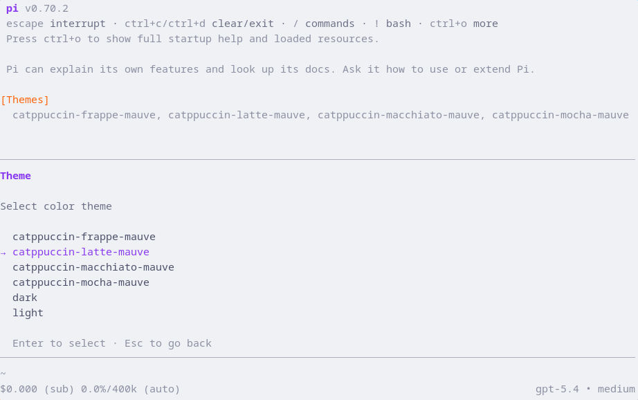
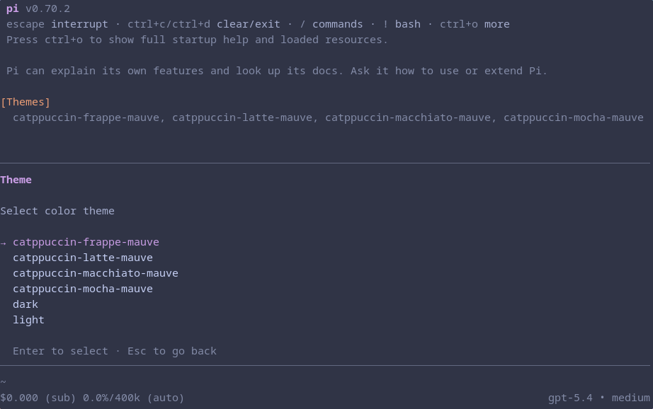
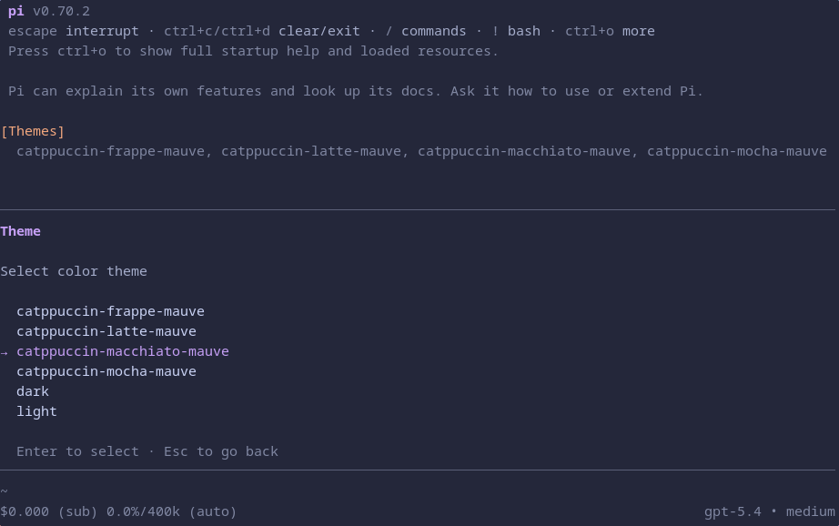
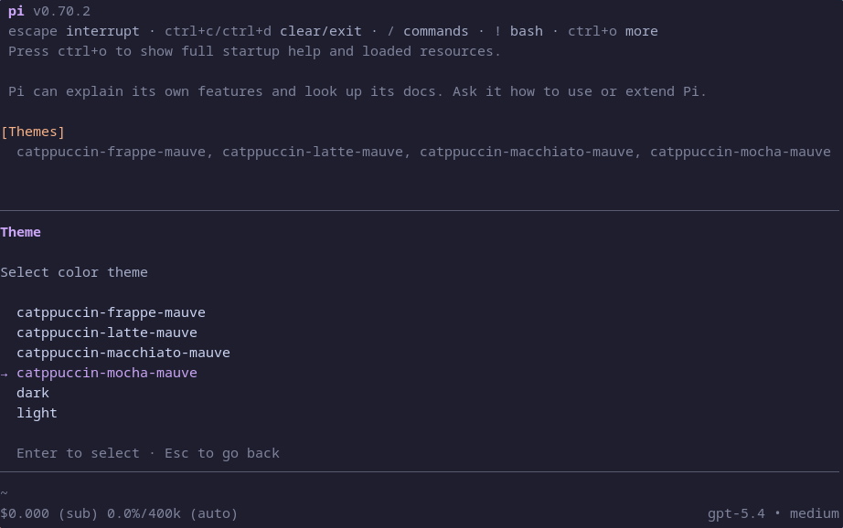

<h3 align="center">
	 
	
	Catppuccin for <a href="https://pi.dev">Pi</a>
	
</h3>

	
	
	

	

## Previews

🌻 Latte

🪴 Frappé

🌺 Macchiato

🌿 Mocha

## Usage

### Manual Installation

1. Download the flavor and accent combination of your choice from [themes](themes).
2. Place the downloaded file in `~/.pi/agent/themes`.
3. Run Pi and go to **Settings** > **Theme** and select your flavor and accent combination of choice.
4. Enjoy!

### Recommended

> [!NOTE]
> This does install every flavor and accent combination instead of just one like the manual installation.

1. Run `pi install git:https://github.com/scarcekoi/pi`
2. Run Pi and go to **Settings** > **Theme** and select your flavor and accent combination of choice.
3. Enjoy!

## 💝 Thanks to

- [Scarce Koi](https://github.com/scarcekoi)

&nbsp;

	

	Copyright &copy; 2021-present <a href="https://github.com/catppuccin" target="_blank">Catppuccin Org</a>

	

